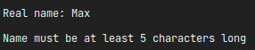
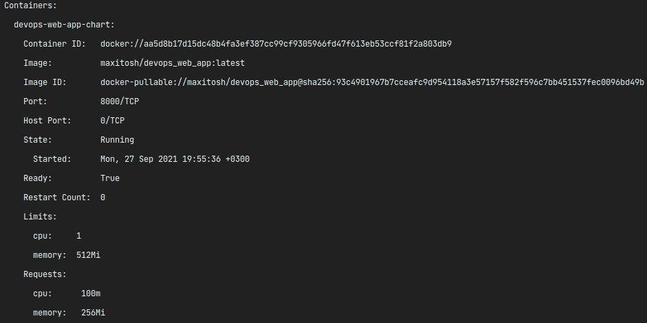

# Lab 11

## Secrets

### Create a secret in cluster using kubectl.

 ```bash
  - echo -n "some_secret_password" > password.txt

  - kubectl create secret generic user-secret-password --from-file=password=./password.txt
    secret/user-secret-password created
    
  - kubectl get secrets
    NAME                                         TYPE                                  DATA   AGE
    default-token-br7lq                          kubernetes.io/service-account-token   3      7d1h
    devops-web-app-chart-token-pw6df             kubernetes.io/service-account-token   3      6d22h
    sh.helm.release.v1.devops-web-app-chart.v1   helm.sh/release.v1                    1      6d22h
    sh.helm.release.v1.devops-web-app-chart.v2   helm.sh/release.v1                    1      6d21h
    user-secret-password                         Opaque                                1      12s


  - kubectl describe secret/user-secret-password
    Name:         user-secret-password
    Namespace:    default
    Labels:       <none>
    Annotations:  <none>
    
    Type:  Opaque
    
    Data
    ====
    password:  20 bytes


  - kubectl get secret user-secret-password -o jsonpath='{.data.password}' | base64 -d
    some_secret_password  
  ```

### MEME time



My real name is **Max**, but gpg key generator does not accept it :))))

### Helm

 ```bash
  -  helm secrets upgrade devops-app-deployment ./devops-web-app-chart/ -n default -f ./devops-web-app-chart/secrets.yaml
    Release "devops-app-deployment" has been upgraded. Happy Helming!
    NAME: devops-app-deployment
    LAST DEPLOYED: Mon Sep 27 20:01:15 2021
    NAMESPACE: default
    STATUS: deployed
    REVISION: 7
    NOTES:
    1. Get the application URL by running these commands:
         NOTE: It may take a few minutes for the LoadBalancer IP to be available.
               You can watch the status of by running 'kubectl get --namespace default svc -w devops-app-deployment-devops-web-app-chart'
      export SERVICE_IP=$(kubectl get svc --namespace default devops-app-deployment-devops-web-app-chart --template "{{ range (index .status.loadBalancer.ingress 0) }}{{.}}{{ end }}")
      echo http://$SERVICE_IP:8000
  
  - kubectl get po
    NAME                                                          READY   STATUS    RESTARTS   AGE
    devops-app-deployment-devops-web-app-chart-6f8948f548-nddvw   1/1     Running   0          14s
    devops-app-deployment-devops-web-app-chart-6f8948f548-shrlr   1/1     Running   0          14s
    devops-app-deployment-devops-web-app-chart-6f8948f548-zlp7c   1/1     Running   0          14s
  
  - kubectl exec devops-app-deployment-devops-web-app-chart-6f8948f548-nddvw -- printenv | grep MY_PASSWORD
    MY_PASSWORD=some_secret_pass
  ```

## Resources

### Config

Simply modify values.yaml file to:

```bash
resources:
  limits:
    cpu: 1000m
    memory: 512Mi
  requests:
    cpu: 100m
    memory: 256Mi
  ```

### Check


