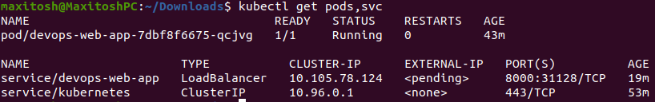
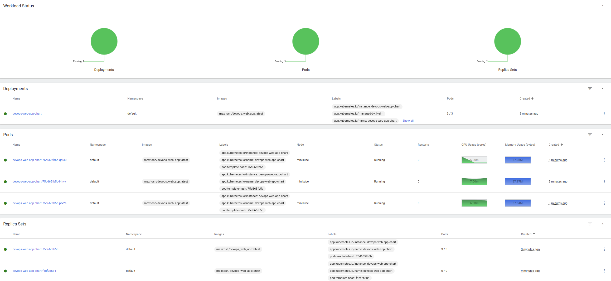

# K8S

## Manual deployment

### Create deployment and service


### Application test after created deployment and service


### Status



**External-ip is still pending, but it will be there in some time.**  
I've noticed than it would be **192.168.49.2**, because of the minikube tunnel configuration.  
Route: 10.96.0.0/12 -> 192.168.49.2, machineName: minikube, Pid: 45246

### Clean up


## Deployment with configuration

### Create deployment and service using manifest


### Status


Let's check:


## Helm

### Installation

```bash
helm install devops-web-app-chart ./devops-web-app-chart
```

### Status





