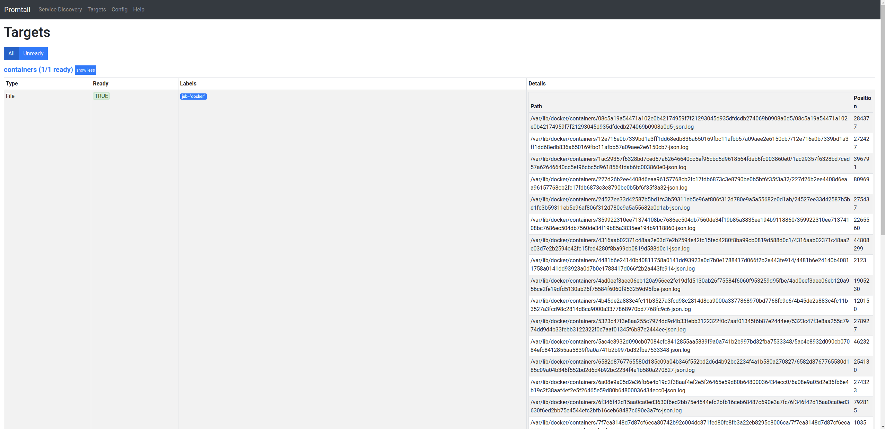
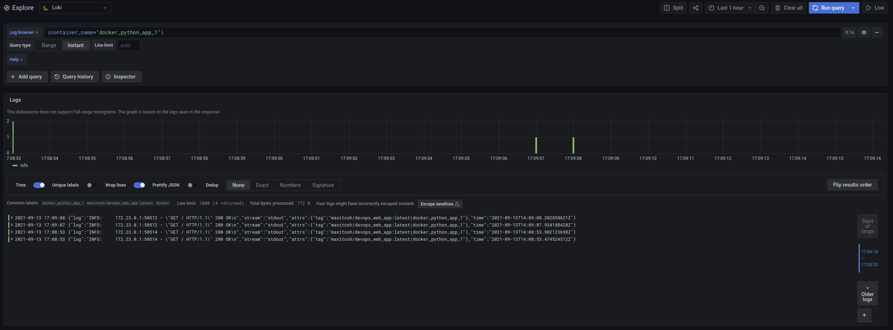
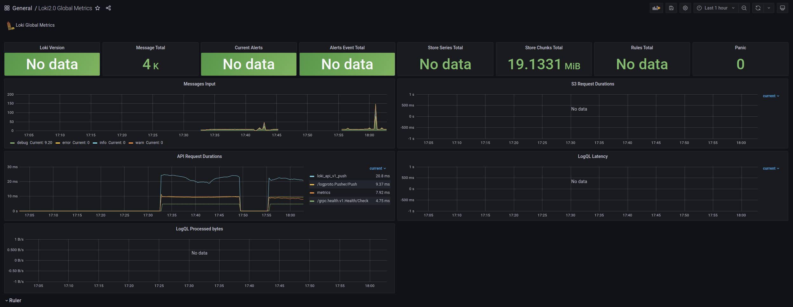
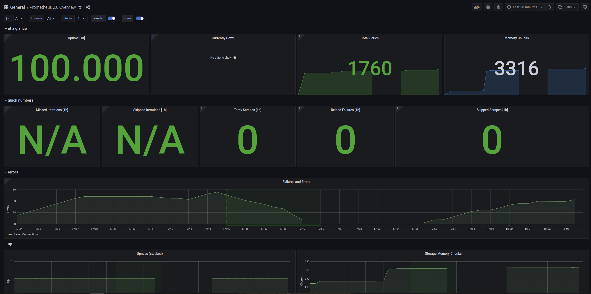

# Logging
## Promtail 

Promtail targets set up successfully:

## Loki and logs 
Logs from Loki and Python application:

## Prometheus

## Best practices 

* Log at the Proper Level
* Employ the Proper Log Category
* Write Meaningful Log Messages
* Write Log Messages in English
* Add Context to Your Log Messages
* Log in Machine Parseable Format
* Don’t Log for Troubleshooting Purposes Only
